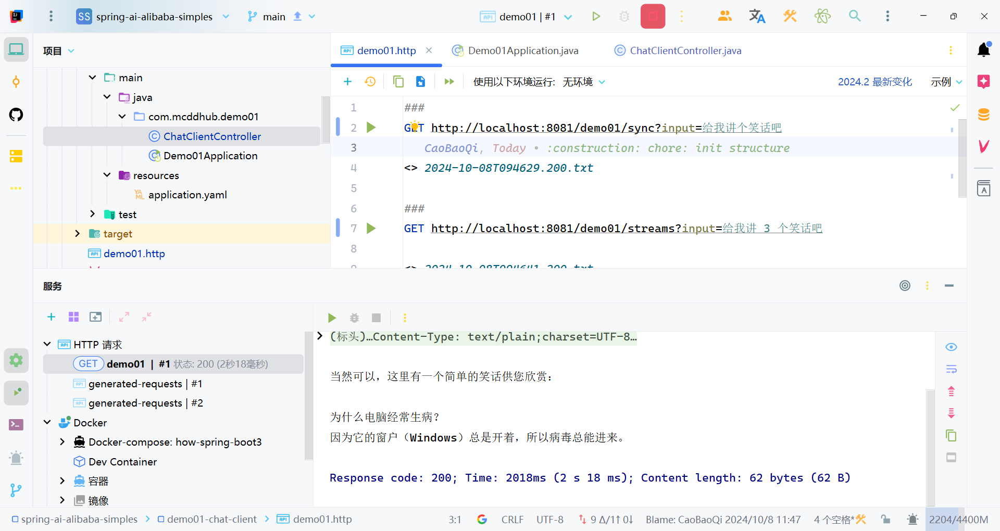
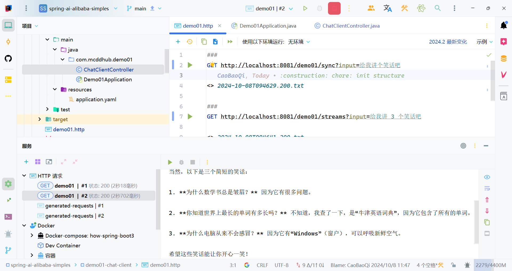
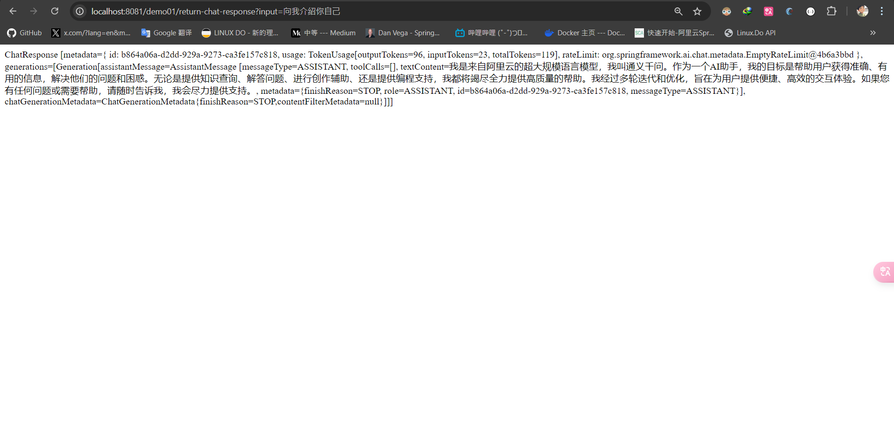
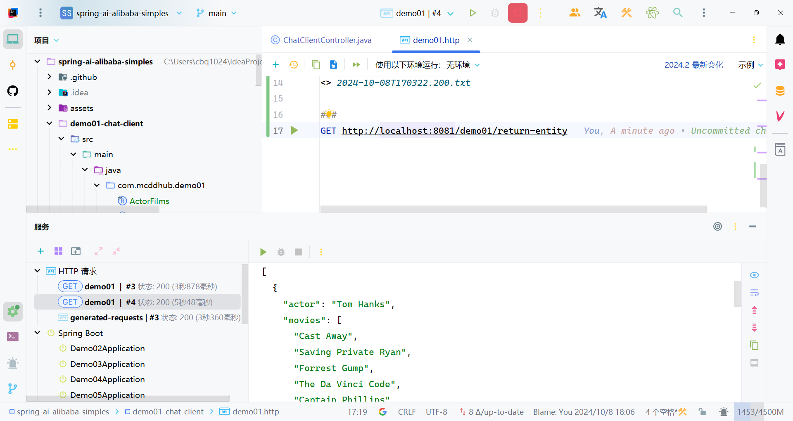
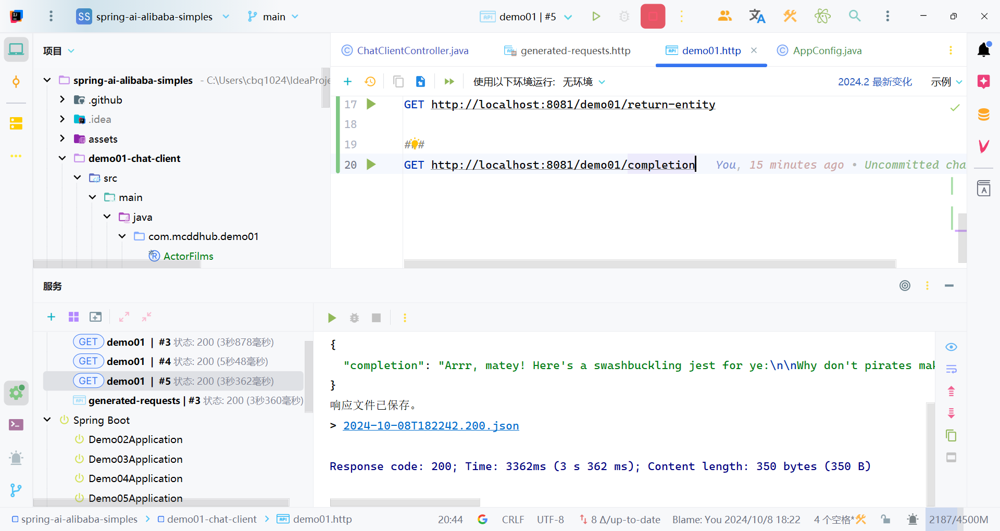
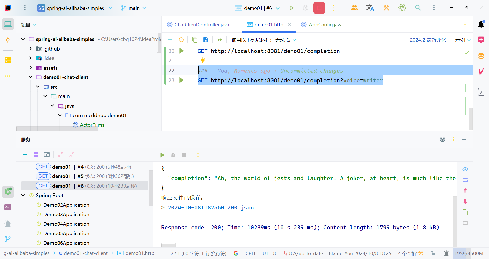
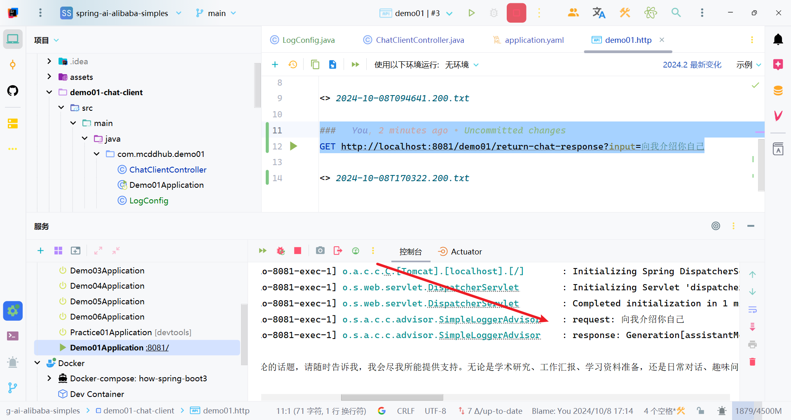

# quick start

> [!TIP]
> Spring AI Alibaba 实现了与阿里云通义模型的完整适配，接下来，我们将学习如何使用 spring ai alibaba 开发一个基于通义模型服务的智能聊天应用。

# step

1. 运行项目 首先，需要获取一个合法的 API-KEY 并设置 DASHSCOPE_API_KEY 环境变量，可跳转 阿里云百炼平台 了解如何获取 API-KEY。

```java
# 用您的 DashScope API-KEY 代替 YOUR_DASHSCOPE_API_KEY (此命令为持久化设置,将 setx 修改为 set 即为临时设置)
setx DASHSCOPE_API_KEY "YOUR_DASHSCOPE_API_KEY"
```

2. 添加依赖 需要在项目中添加 `spring-ai-alibaba-starter` 依赖，它将通过 Spring Boot 自动装配机制初始化与阿里云通义大模型通信的 `ChatClient`、`ChatModel` 相关实例。

```java
<dependency>
  <groupId>com.alibaba.cloud.ai</groupId>
  <artifactId>spring-ai-alibaba-starter</artifactId>
  <version>1.0.0-m2</version>
</dependency>
```

> [!TIP]
>
> 由于 spring-ai 相关依赖包还没有发布到中央仓库，如出现 spring-ai-core 等相关依赖解析问题，请在您项目的 pom.xml 依赖中加入如下仓库配置。
>
> ```xml
> <repositories>
>   <repository>
>     <id>spring-milestones</id>
>     <name>Spring Milestones</name>
>     <url>https://repo.spring.io/milestone</url>
>     <snapshots>
>       <enabled>false</enabled>
>     </snapshots>
>   </repository>
> </repositories>
> ```

3. 配置 yaml

```yaml
spring:
    application:
        name: demo01-chat-client
    ai:
        dashscope:
            api-key: ${DASHSCOPE_API_KEY}
server:
    port: 8081
```

4. 注入 ChatClient

```java
@RestController
@RequestMapping("/demo01")
public class ChatClientController {

    private final ChatClient chatClient;

    public ChatClientController(ChatClient.Builder builder) {
        this.chatClient = builder.build();
    }

    @GetMapping("/sync")
    public String chat(String input) {
        return this.chatClient
            .prompt()
            .user(input)
            .call()
            .content();
    }
}
```

5. 测试

```http
###
GET http://localhost:8081/demo01/sync?input=给我讲个笑话吧
```



# 流式输出

```java
    @GetMapping("/streams")
    public String stream(String input) {
        Flux<String> content = this.chatClient
            .prompt()
            .user(input)
            .stream()
            .content();
        return Objects.requireNonNull(content.collectList().block())
            .stream()
            .reduce((a, b) -> a + b)
            .orElseThrow(() -> new RuntimeException("No streams available"));
    }
```

```http
###
GET http://localhost:8081/demo01/streams?input=给我讲 3 个笑话吧
```



# 调整与模型对话时的参数

以上示例中，ChatClient 调用大模型使用的是默认参数，Spring AI Alibaba 还支持通过 `DashScopeChatOptions` 调整与模型对话时的参数，`DashScopeChatOptions` 支持两种不同维度的配置方式：

- 全局默认值，即 `ChatClient` 实例初始化参数

可以在 `application.yaml` 文件中指定 `spring.ai.dashscope.chat.options.*` 或调用构造函数 `ChatClient.Builder.defaultOptions(options)`、`DashScopeChatModel(api, options)` 完成配置初始化。

- 每次 Prompt 调用前动态指定

```java
    @GetMapping("/chat-with-qwen-plus")
    public String chatWithQwenPlus(String input) {
        return this.chatModel
            .call(new Prompt(
                "Generate the names of 5 famous pirates.",
                DashScopeChatOptions.builder()
                    .withModel("qwen-plus")
                    .withTemperature(0.4F).build()).getContents());
    }
```

# Chat Client

>[!TIP]
>
>**`ChatClient` 提供了与 AI 模型通信的 Fluent API，它支持同步和反应式（Reactive）编程模型。与 `ChatModel`、`Message`、`ChatMemory` 等原子 API 相比，使用 `ChatClient` 可以将与 LLM 及其他组件交互的复杂性隐藏在背后，因为基于 LLM 的应用程序通常要多个组件协同工作（例如，提示词模板、聊天记忆、LLM Model、输出解析器、RAG 组件：嵌入模型和存储），并且通常涉及多个交互，因此协调它们会让编码变得繁琐。**

**当然使用 `ChatModel` 等原子 API 可以为应用程序带来更多的灵活性，成本就是您需要编写大量样板代码。ChatClient 类似于应用程序开发中的服务层，它为应用程序直接提供 `AI 服务`，开发者可以使用 ChatClient Fluent API 快速完成一整套 AI 交互流程的组装。包括一些基础功能，如：**

- **定制和组装模型的输入（Prompt）**
- **格式化解析模型的输出（Structured Output）**
- **调整模型交互参数（ChatOptions）**

**还支持更多高级功能：**

- **聊天记忆（Chat Memory）**
- **工具/函数调用（Function Calling）**
- **RAG**

# 创建 ChatClient

使用 `ChatClient.Builder` 对象创建 `ChatClient` 实例，您可以自动注入由Spring Boot 自动配置创建的默认 `ChatClient.Builder` 实例，您也可以通过编程方式自行创建一个 `ChatClient.Builder` 实例并用它来得到 `ChatClient` 实例。

## 使用自动配置的 ChatClient.Builder

在快速开始示例中，就是使用的 Spring Boot 自动装配默认生成的 `ChatClient.Builder` 的 bean，把它注入到您自己的类中。这里是根据用户提问并从模型得到文本回答的简单例子：

```java
@RestController
@RequestMapping("/demo01")
public class ChatClientController {

    private final ChatClient chatClient;

    public ChatClientController(ChatClient.Builder builder) {
        this.chatClient = builder.build();
    }

    @GetMapping("/sync")
    public String chat(String input) {
        return this.chatClient
            .prompt()
            .user(input)
            .call()
            .content();
    }
}
```

在这个示例中，首先设置了用户消息的内容，call 方法向 AI 模型发送请求，content 方法以字符串形式返回 AI 模型的响应。

## 以编程方式创建 ChatClient

**您可以通过设置属性 `spring.ai.chat.client.enabled=false` 来禁用 `ChatClient.Builder` bean 的自动配置，如果需要多个聊天模型一起使用，这会很有用，然后以编程方式创建 `ChatClient.Builder`，这样可以为每个聊天模型创建一个实例 `ChatModel`：**

```java
    ChatModel myChatModel = ... // usually autowired

    ChatClient.Builder builder = ChatClient.builder(myChatModel);

    // or create a ChatClient with the default builder settings:
    ChatClient chatClient = ChatClient.create(myChatModel);
```

# 处理 ChatClient 响应

ChatClient API 提供了多种方法来格式化来自 AI 模型的响应。

## 返回 ChatResponse

AI 模型的响应是一种由 [ChatResponse](https://docs.spring.io/spring-ai/reference/api/chatmodel.html#ChatResponse) 类型定义的丰富结构。它包含响应生成相关的元数据，同时它还可以包含多个子响应（称为[Generation](https://docs.spring.io/spring-ai/reference/api/chatmodel.html#Generation)），每个子响应都有自己的元数据。元数据包括用于创建响应的令牌（token）数量信息（在英文中，每个令牌大约为一个单词的 3/4），了解令牌信息很重要，因为 AI 模型根据每个请求使用的令牌数量收费。下面的代码段显示了通过调用 `chatResponse()` 返回 `ChatResponse` 的示例，相比于调用 `content()` 方法，这里在调用 `call()` 方法之后返回 `ChatResponse`

```java
    @GetMapping("/return-chat-response")
    public String returnChatResponse(String input) {
        ChatResponse chatResponse = this.chatClient
            .prompt()
            .user(input)
            .call()
            .chatResponse();
        return chatResponse.toString();
    }
```



## 返回实体类（Entity）

您经常希望返回一个预先定义好的实体类型响应，Spring AI 框架可以自动替我们完成从 `String` 到实体类的转换，调用`entity()` 方法可完成响应数据转换。

例如，给定 Java record（POJO）定义：

```java
record ActorFilms(String actor, List<String> movies) {}
```

您可以使用该 `entity` 方法轻松地将 AI 模型的输出映射到 ActorFilms 类型，如下所示：

```java
    ActorFilms actorFilms = chatClient.prompt()
        .user("Generate the filmography for a random actor.")
        .call()
        .entity(ActorFilms.class);
```

`entity` 还有一种带有参数的重载方法 `entity(ParameterizedTypeReference<T> type)`，可让您指定如泛型 List 等类型：

```java
    List<ActorFilms> actorFilms = chatClient.prompt()
        .user("Generate the filmography of 5 movies for Tom Hanks and Bill Murray.")
        .call()
        .entity(new ParameterizedTypeReference<List<ActorFilms>>() {
        });
```



## 流式响应

`stream` 方法是一种异步的、持续的获得模型响应的方式：

```
    Flux<String> output = chatClient.prompt()
        .user("Tell me a joke")
        .stream()
        .content();
```

相比于上面的 `Flux<String>`，您还可以使用 `Flux<ChatResponse> chatResponse()` 方法获得 `ChatResponse` 响应数据流。

# call() 返回值

`ChatClient.call()` 方法支持几种不同类型的响应格式。

- `String content()`：返回响应的字符串内容
- `ChatResponse chatResponse()`：返回`ChatResponse`包含多个代以及有关响应的元数据的对象，例如，使用了多少个令牌来创建响应。
- entity 返回 Java 类型
  - entity(ParameterizedTypeReference type)：用于返回实体类型的集合。
  - entity(Class type): 用于返回特定的实体类型。
  - entity(StructuredOutputConverter structuredOutputConverter): 用于指定一个实例 `StructuredOutputConverter`，将 `String` 转换为实体类型。

# stream() 返回值

您还可以调用该`stream`方法而不是`call`，在指定`stream`方法后`ChatClient`，响应类型有几个选项：

- `Flux<String> content()`：返回由 AI 模型生成的字符串的 Flux。
- `Flux<ChatResponse> chatResponse()`：返回对象的 Flux `ChatResponse`，其中包含有关响应的附加元数据。

# 定制 ChatClient 默认值

在前面 ChatClient 的初步体验中，我们使用 `ChatClient.Builder.build()` 快速创建了一个 ChatClient 实例，**开发者还可以通过修改 `ChatClient.Builder` 定制 ChatClient 实例**。

> [!TIP]
>
> 注意，**创建 ChatClient 时指定的配置将作为与模型交互时的默认参数，这样可以避免每次调用都重复设置**。

## 设置默认 System Message

在以下示例中，我们为 ChatClient 设置了一个默认的 system message（以海盗风格回答所有问题），这样，当 ChatClient 与模型交互时都会自动携带这条 system message，用户只需要指定 user message 即可。

```java
    public ChatClientController(ChatClient.Builder builder, SimpleLoggerAdvisor loggerAdvisor) {
        this.chatClient = builder
            .defaultSystem("You are a friendly chat bot that answers question in the voice of a Pirate")
            .build();
        this.loggerAdvisor = loggerAdvisor;
    }
```

在 Controller 中使用这个 ChatClient

```java
    @GetMapping("/completion")
    public Map<String, String> completion(
        @RequestParam(value = "input", defaultValue = "Tell me a joker") String input) {
        return Map.of("completion", this.chatClient
            .prompt()
            .user(input)
            .call()
            .content());
    }
```

启动示例，通过 curl 测试效果：

```http
###
GET http://localhost:8081/demo01/completion
```



在上面 `builder.defaultSystem()` 创建 ChatClient 的时，我们还可以选择使用模板，类似 “You are a friendly chat bot that answers question in the voice of a {voice}“，这让我们有机会在每次调用前修改请求参数。

```java
public ChatClientController(ChatClient.Builder builder, SimpleLoggerAdvisor loggerAdvisor) {
        this.chatClient = builder
            .defaultSystem("You are a friendly chat bot that answers question in the voice of a {voice}")
            .build();
        this.loggerAdvisor = loggerAdvisor;
    }
```

```java
    @GetMapping("/completion")
    public Map<String, String> completion(
        @RequestParam(value = "input", defaultValue = "Tell me a joker") String input,
        @RequestParam(value = "voice", defaultValue = "Pirate") String voice) {
        return Map.of("completion", this.chatClient
            .prompt()
                .system(sp -> sp.param("voice", voice))
            .user(input)
            .call()
            .content());
    }
```

测试

```http
###
GET http://localhost:8081/demo01/completion?voice=writer
```



## 其他默认设置

除了 `defaultSystem` 之外，您还可以在 `ChatClient.Builder` 级别上指定其他默认提示。

- `defaultOptions(ChatOptions chatOptions)`：传入 `ChatOptions` 类中定义的可移植选项或特定于模型实现的如 `DashScopeChatOptions` 选项。有关特定于模型的`ChatOptions`实现的更多信息，请参阅 JavaDocs。
- `defaultFunction(String name, String description, java.util.function.Function<I, O> function)`：`name` 用于在用户文本中引用该函数，`description`解释该函数的用途并帮助 AI 模型选择正确的函数以获得准确的响应，参数 `function` 是模型将在必要时执行的 Java 函数实例。
- `defaultFunctions(String... functionNames)`：应用程序上下文中定义的 java.util.Function 的 bean 名称。
- `defaultUser(String text)`、`defaultUser(Resource text)`、`defaultUser(Consumer<UserSpec> userSpecConsumer)` 这些方法允许您定义用户消息输入，`Consumer<UserSpec>`允许您使用 lambda 指定用户消息输入和任何默认参数。
- `defaultAdvisors(RequestResponseAdvisor... advisor)`：Advisors 允许修改用于创建 `Prompt` 的数据，`QuestionAnswerAdvisor` 实现通过在 Prompt 中附加与用户文本相关的上下文信息来实现 `Retrieval Augmented Generation` 模式。
- `defaultAdvisors(Consumer<AdvisorSpec> advisorSpecConsumer)`：此方法允许您定义一个 `Consumer` 并使用 `AdvisorSpec` 配置多个 Advisor，Advisor 可以修改用于创建 `Prompt` 的最终数据，`Consumer<AdvisorSpec>` 允许您指定 lambda 来添加 Advisor 例如 `QuestionAnswerAdvisor`。

您可以在运行时使用 `ChatClient` 提供的不带 `default` 前缀的相应方法覆盖这些默认值。

- `options(ChatOptions chatOptions)`
- `function(String name, String description, java.util.function.Function<I, O> function)`
- `functions(String... functionNames)`
- `user(String text)`、`user(Resource text)`、`user(Consumer<UserSpec> userSpecConsumer)`
- `advisors(RequestResponseAdvisor... advisor)`
- `advisors(Consumer<AdvisorSpec> advisorSpecConsumer)`

# Advisors

在使用用户输入文本构建 Prompt 调用 AI 模型时，一个常见模式是使用上下文数据附加或扩充 Prompt，最终使用扩充后的 Prompt 与模型交互。这些用于扩充 Prompt 的上下文数据可以是不同类型的，常见类型包括：

- **您自己的数据**：这是 AI 模型尚未训练过的数据，如特定领域知识、产品文档等，即使模型已经看到过类似的数据，附加的上下文数据也会优先生成响应。
- **对话历史记录**：聊天模型的 API 是无状态的，如果您告诉 AI 模型您的姓名，它不会在后续交互中记住它，每次请求都必须发送对话历史记录，以确保在生成响应时考虑到先前的交互。

## 检索增强生成（RAG）

向量数据库存储的是 AI 模型不知道的数据，当用户问题被发送到 AI 模型时，`QuestionAnswerAdvisor` 会在向量数据库中查询与用户问题相关的文档。来自向量数据库的响应被附加到用户消息 Prompt 中，为 AI 模型生成响应提供上下文。假设您已将数据加载到中 `VectorStore`，则可以通过向 `ChatClient` 提供 `QuestionAnswerAdvisor` 实例来执行检索增强生成 (RAG ) 。

```java
todo
```

在此示例中，`SearchRequest.defaults()` 将对 Vector 向量数据库中的所有文档执行相似性搜索。为了限制要搜索的文档类型，`SearchRequest` 采用了可移植到任意向量数据库中的类似 SQL 筛选表达式。

### 动态过滤表达式

`SearchRequest` 使用 `FILTER_EXPRESSION` Advisor 上下文参数在运行时更新过滤表达式：

```java
todo
```

该 `FILTER_EXPRESSION` 参数允许您根据提供的表达式动态过滤搜索结果。

### 聊天记忆

`ChatMemory` 接口表示聊天对话历史记录的存储，它提供向对话添加消息、从对话中检索消息以及清除对话历史记录的方法。

目前提供两种实现方式 

- `InMemoryChatMemory`: 聊天对话历史记录提供内存存储
- `CassandraChatMemory`:  `time-to-live` 类型的持久存储

创建一个包含 `time-to-live` 配置的 `CassandraChatMemory`

```java
todo
```

以下 Advisor 实现使用 `ChatMemory` 接口来使用对话历史记录来增强（advice）Prompt，这些 advisor 实现在如何将对话历史记录添加到 Prompt 的细节上有所不同。

- `MessageChatMemoryAdvisor`：检索内存并将其作为消息集合添加到提示中
- `PromptChatMemoryAdvisor`：检索内存并将其添加到提示的系统文本中
- `VectorStoreChatMemoryAdvisor` ：构造函数`VectorStoreChatMemoryAdvisor(VectorStore vectorStore, String defaultConversationId, int chatHistoryWindowSize)`允许您指定要从中检索聊天历史记录的 VectorStore、唯一的对话 ID、要检索的聊天历史记录的大小（以令牌大小为单位）。

下面的 `@Service` 提供了一个使用多个 Advisor 的示例实现：

```java
todo
```


### 日志记录

`SimpleLoggerAdvisor` 是一个用于记录 ChatClient 的 `request` 和 `response` 数据 Advisor，这对于调试和监控您的 AI 交互非常有用。您可以使用以下构造函数自定义如何使用 `SimpleLoggerAdvisor` 记录来自 AdvisedRequest 和 ChatResponse 的数据：

```java
@Configuration
public class LogConfig {

    @Bean
    public SimpleLoggerAdvisor simpleLoggerAdvisor() {
        return new SimpleLoggerAdvisor(
            AdvisedRequest::userText,
            response -> "" + response.getResult()
        );
    }
}
```

要启用日志记录，请在创建 ChatClient 时将 `SimpleLoggerAdvisor` 添加到 Advisor 链中。建议将其添加到链的末尾：

```java
    @GetMapping("/return-chat-response")
    public String returnChatResponse(String input) {
        return this.chatClient
            .prompt()
            .advisors(this.loggerAdvisor)
            .user(input)
            .call()
            .chatResponse().toString();

    }
```

要查看日志，请将 Advisor 包的日志记录级别设置为 `DEBUG`：

```yaml
spring:
    application:
        name: demo01-chat-client
    ai:
        dashscope:
            api-key: ${DASHSCOPE_API_KEY}
server:
    port: 8081

logging:
    level:
        org:
            springframework:
                ai:
                    chat:
                        client:
                            advisor: debug
```

将其添加到您的 `application.properties` 或 `application.yaml` 文件中。使用示例：

```java
###
GET http://localhost:8081/demo01/return-chat-response?input=向我介绍你自己
```

这使得您可以根据您的特定需求定制需要记录的信息。




# 完整 pom.xml

```xml
<?xml version="1.0" encoding="UTF-8"?>
<project xmlns="http://maven.apache.org/POM/4.0.0" xmlns:xsi="http://www.w3.org/2001/XMLSchema-instance"
         xsi:schemaLocation="http://maven.apache.org/POM/4.0.0 https://maven.apache.org/xsd/maven-4.0.0.xsd">
    <modelVersion>4.0.0</modelVersion>
    <parent>
        <groupId>org.springframework.boot</groupId>
        <artifactId>spring-boot-starter-parent</artifactId>
        <version>3.3.3</version>
        <relativePath/> <!-- lookup parent from repository -->
    </parent>
    <groupId>com.mcddhub.ai</groupId>
    <artifactId>demo01-chat-client</artifactId>
    <version>0.0.1</version>
    <name>demo01-chat-client</name>
    <description>Demo project for Spring AI Alibaba</description>

    <properties>
        <project.build.sourceEncoding>UTF-8</project.build.sourceEncoding>
        <project.reporting.outputEncoding>UTF-8</project.reporting.outputEncoding>
        <maven.compiler.source>17</maven.compiler.source>
        <maven.compiler.target>17</maven.compiler.target>
        <maven-deploy-plugin.version>3.1.1</maven-deploy-plugin.version>

        <!-- Spring AI -->
        <spring-ai-alibaba.version>1.0.0-M2</spring-ai-alibaba.version>
    </properties>

    <dependencies>
        <dependency>
            <groupId>com.alibaba.cloud.ai</groupId>
            <artifactId>spring-ai-alibaba-starter</artifactId>
            <version>${spring-ai-alibaba.version}</version>
        </dependency>
        <dependency>
            <groupId>org.springframework.boot</groupId>
            <artifactId>spring-boot-starter-web</artifactId>
        </dependency>
        <dependency>
            <groupId>org.springframework.boot</groupId>
            <artifactId>spring-boot-starter-test</artifactId>
            <scope>test</scope>
            <exclusions>
                <exclusion>
                    <groupId>com.vaadin.external.google</groupId>
                    <artifactId>android-json</artifactId>
                </exclusion>
            </exclusions>
        </dependency>
        <dependency>
            <groupId>io.rest-assured</groupId>
            <artifactId>rest-assured</artifactId>
            <scope>test</scope>
        </dependency>
    </dependencies>

    <build>
        <plugins>
            <plugin>
                <groupId>org.springframework.boot</groupId>
                <artifactId>spring-boot-maven-plugin</artifactId>
            </plugin>
            <plugin>
                <groupId>org.apache.maven.plugins</groupId>
                <artifactId>maven-deploy-plugin</artifactId>
                <version>${maven-deploy-plugin.version}</version>
                <configuration>
                    <skip>true</skip>
                </configuration>
            </plugin>
        </plugins>
    </build>

    <repositories>
        <repository>
            <id>spring-milestones</id>
            <name>Spring Milestones</name>
            <url>https://repo.spring.io/milestone</url>
            <snapshots>
                <enabled>false</enabled>
            </snapshots>
        </repository>
    </repositories>

</project>

```

