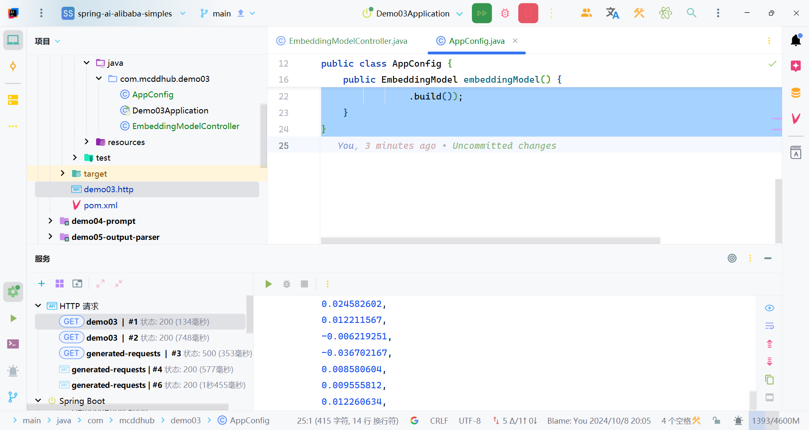
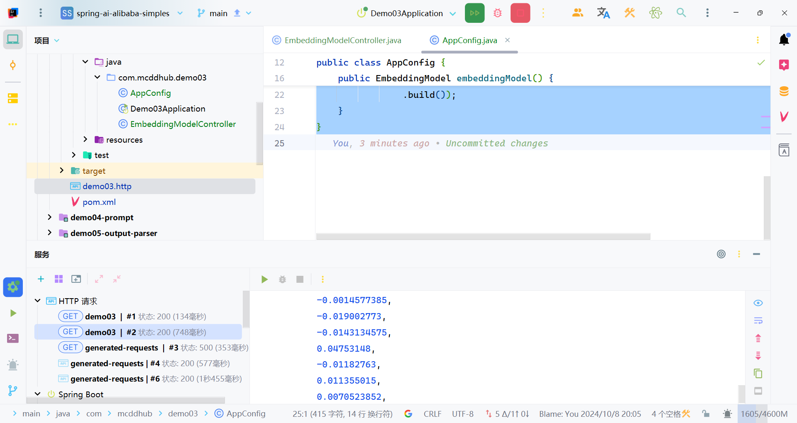
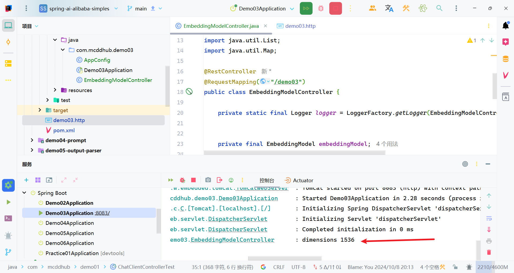
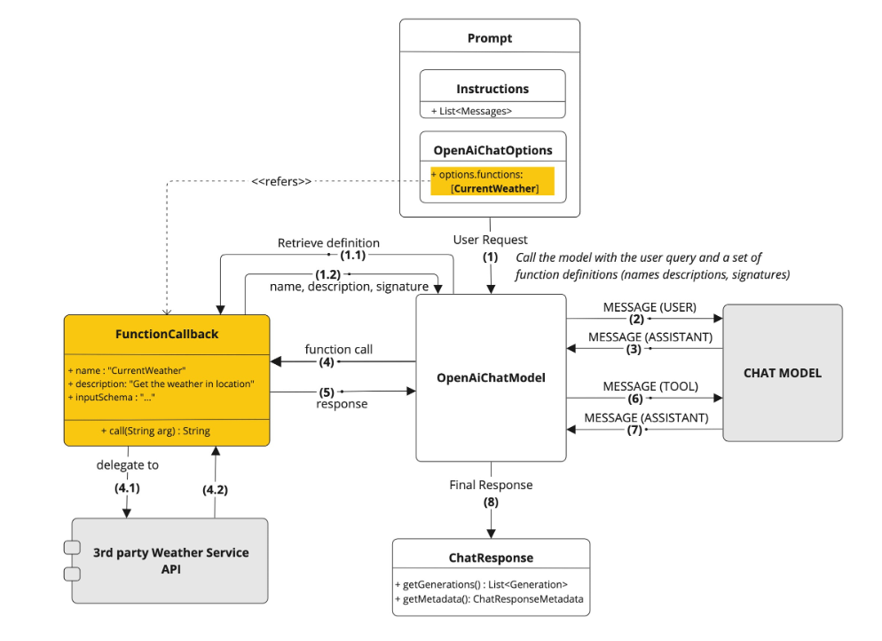

# 嵌入模型 (Embedding Model)

>[!TIP]
> 
> **嵌入(`Embedding`)的工作原理是将文本、图像和视频转换为称为向量（Vectors）的浮点数数组。这些向量旨在捕捉文本、图像和视频的含义。嵌入数组的长度称为向量的维度（Dimensionality）。**

**嵌入模型（`EmbeddingModel`）是嵌入过程中采用的模型。当前 EmbeddingModel 的接口主要用于将文本转换为数值向量，接口的设计主要围绕这两个目标展开：**

- **可移植性：该接口确保在各种嵌入模型之间的轻松适配。它允许开发者在不同的嵌入技术或模型之间切换，所需的代码更改最小化。这一设计与 Spring 模块化和互换性的理念一致。**
- **简单性：嵌入模型简化了文本转换为嵌入的过程。通过提供如`embed(String text)`和`embed(Document document)`这样简单的方法，它去除了处理原始文本数据和嵌入算法的复杂性。这个设计选择使开发者，尤其是那些初次接触 AI 的开发者，更容易在他们的应用程序中使用嵌入，而无需深入了解其底层机制。**

# EmbeddingModel API介绍

```java
package org.springframework.ai.embedding;

import org.springframework.ai.document.Document;
import org.springframework.ai.model.Model;
import org.springframework.util.Assert;

import java.util.ArrayList;
import java.util.List;

/**
 * EmbeddingModel is a generic interface for embedding models.
 *
 * @author Mark Pollack
 * @author Christian Tzolov
 * @author Josh Long
 * @author Soby Chacko
 * @since 1.0.0
 *
 */
public interface EmbeddingModel extends Model<EmbeddingRequest, EmbeddingResponse> {

	@Override
	EmbeddingResponse call(EmbeddingRequest request);

	/**
	 * Embeds the given text into a vector.
	 * @param text the text to embed.
	 * @return the embedded vector.
	 */
	default float[] embed(String text) {
		Assert.notNull(text, "Text must not be null");
		List<float[]> response = this.embed(List.of(text));
		return response.iterator().next();
	}

	/**
	 * Embeds the given document's content into a vector.
	 * @param document the document to embed.
	 * @return the embedded vector.
	 */
	float[] embed(Document document);

	/**
	 * Embeds a batch of texts into vectors.
	 * @param texts list of texts to embed.
	 * @return list of list of embedded vectors.
	 */
	default List<float[]> embed(List<String> texts) {
		Assert.notNull(texts, "Texts must not be null");
		return this.call(new EmbeddingRequest(texts, EmbeddingOptionsBuilder.builder().build()))
			.getResults()
			.stream()
			.map(Embedding::getOutput)
			.toList();
	}

	/**
	 * Embeds a batch of {@link Document}s into vectors based on a
	 * {@link BatchingStrategy}.
	 * @param documents list of {@link Document}s.
	 * @param options {@link EmbeddingOptions}.
	 * @param batchingStrategy {@link BatchingStrategy}.
	 * @return a list of float[] that represents the vectors for the incoming
	 * {@link Document}s.
	 */
	default List<float[]> embed(List<Document> documents, EmbeddingOptions options, BatchingStrategy batchingStrategy) {
		Assert.notNull(documents, "Documents must not be null");
		List<float[]> embeddings = new ArrayList<>();

		List<List<Document>> batch = batchingStrategy.batch(documents);

		for (List<Document> subBatch : batch) {
			List<String> texts = subBatch.stream().map(Document::getContent).toList();
			EmbeddingRequest request = new EmbeddingRequest(texts, options);
			EmbeddingResponse response = this.call(request);
			for (int i = 0; i < subBatch.size(); i++) {
				Document document = subBatch.get(i);
				float[] output = response.getResults().get(i).getOutput();
				embeddings.add(output);
				document.setEmbedding(output);
			}
		}
		return embeddings;
	}

	/**
	 * Embeds a batch of texts into vectors and returns the {@link EmbeddingResponse}.
	 * @param texts list of texts to embed.
	 * @return the embedding response.
	 */
	default EmbeddingResponse embedForResponse(List<String> texts) {
		Assert.notNull(texts, "Texts must not be null");
		return this.call(new EmbeddingRequest(texts, EmbeddingOptionsBuilder.builder().build()));
	}

	/**
	 * @return the number of dimensions of the embedded vectors. It is generative
	 * specific.
	 */
	default int dimensions() {
		return embed("Test String").length;
	}

}

```

Embedding Model API 提供多种选项，将文本转换为 Embeddings，支持单个字符串、结构化的 Document 对象或文本批处理。有多种快捷方式可以获得文本 Embeddings。例如`embed(String text)`方法，它接受单个字符串并返回相应的 Embedding 向量。所有方法都围绕着`call`方法实现，这是调用 Embedding Model 的主要方法。通常，Embedding 返回一个 float 数组，以数值向量格式表示Embeddings。

- `embedForResponse`方法提供了更全面的输出，可能包括有关 Embeddings 的其他信息。
- `dimensions`方法是开发人员快速确定 Embedding 向量大小的便利工具，这对于理解 Embedding space 和后续处理步骤非常重要。

`EmbeddingRequest`是一种`ModelRequest`，它接受文本对象列表和可选的 Embedding 请求选项。以下代码片段简要地显示了 EmbeddingRequest 类，省略了构造函数和其他工具方法：

```java
public class EmbeddingRequest implements ModelRequest<List<String>> {
private final List<String> inputs;
private final EmbeddingOptions options;
// other methods omitted
}
```

`EmbeddingResponse`类的结构如下：

```java
public class EmbeddingResponse implements ModelResponse<Embedding> {
    private List<Embedding> embeddings;
    private EmbeddingResponseMetadata metadata = new EmbeddingResponseMetadata();
    // other methods omitted
}
```

`EmbeddingResponse`类保存了 AI 模型的输出，其中每个 Embedding 实例包含来自单个文本输入的结果向量数据。同时，它还携带了有关 AI 模型响应的`EmbeddingResponseMetadata`元数据。`Embedding`表示一个 Embedding 向量。

```java
public class Embedding implements ModelResult<List<Double>> {
    private List<Double> embedding;
    private Integer index;
    private EmbeddingResultMetadata metadata;
// other methods omitted
}
```

# 示例用法

该示例将创建一个`EmbeddingModel`实例，您可以将其注入到您的类中。以下是一个简单的`@Controller`类的示例，它使用了该 EmbeddingModel 实例。

```java
@RestController
public class EmbeddingController {

    private final EmbeddingModel embeddingModel;

    @Autowired
    public EmbeddingController(EmbeddingModel embeddingModel) {
        this.embeddingModel = embeddingModel;
    }

    @GetMapping("/ai/embedding")
    public Map embed(@RequestParam(value = "message", defaultValue = "Tell me a joke") String message) {
        EmbeddingResponse embeddingResponse = this.embeddingModel.embedForResponse(List.of(message));
        return Map.of("embedding", embeddingResponse);
    }
}
```

```http
###
GET http://localhost:8083/demo03/embed
```



# 自定义

```java
@Configuration
public class AppConfig {
    DashScopeApi dashScopeApi = new DashScopeApi(System.getenv("DASHSCOPE_API_KEY"));

    @Bean
    public EmbeddingModel embeddingModel() {
        return new DashScopeEmbeddingModel(
            dashScopeApi,
            MetadataMode.EMBED,
            DashScopeEmbeddingOptions.builder()
                .withModel("text-embedding-v2")
                .build());
    }
}


    @GetMapping("/similar")
    public Map<String, EmbeddingResponse> similar() {
        EmbeddingResponse embeddingResponse = this.embeddingModel
            .embedForResponse(List.of("Hello World", "World is big and salvation is near"));
        logger.info("dimensions {}",this.embeddingModel.dimensions());
        return Map.of("embed", embeddingResponse);
    }


```

```java
###
GET http://localhost:8083/demo03/similar
```





# 工具(Function Calling)

“工具（Tool）”或 “功能调用（Function Calling）”允许大型语言模型（LLM）在必要时调用一个或多个可用的工具，这些工具通常由开发者定义。工具可以是任何东西：网页搜索、对外部 API 的调用，或特定代码的执行等。LLM 本身不能实际调用工具；相反，它们会在响应中表达调用特定工具的意图（而不是以纯文本回应）。然后，我们应用程序应该执行这个工具，并报告工具执行的结果给模型。

例如，我们知道 LLM 自身在数学方面不是特别擅长。如果你的用例偶尔涉及数学计算，你可能会想提供给 LLM 一个“数学工具”。通过在请求中声明一个或多个工具，LLM 可以在认为合适时调用其中之一。给定一个数学问题和一组数学工具，LLM 可能会决定为正确回答问题，它应该首先调用其中一个提供的数学工具。接下来，让我们用一个示例看一下 Function Calling 的具体工作过程。以下是没有 Function Calling 的一个消息交互过程示例，模型给给出的结果非常接近但是并不正确：

```tex
Request:
- messages:
    - UserMessage:
        - text: What is the square root of 475695037565?

Response:
- AiMessage:
    - text: The square root of 475695037565 is approximately 689710.
```

以下是包含了 Function Calling 的消息交互过程：

```tex
Request 1:
- messages:
    - UserMessage:
        - text: What is the square root of 475695037565?
- tools:
    - sum(double a, double b): Sums 2 given numbers
    - squareRoot(double x): Returns a square root of a given number

Response 1:
- AiMessage:
    - toolExecutionRequests:
        - squareRoot(475695037565)


... here we are executing the squareRoot method with the "475695037565" argument and getting "689706.486532" as a result ...


Request 2:
- messages:
    - UserMessage:
        - text: What is the square root of 475695037565?
    - AiMessage:
        - toolExecutionRequests:
            - squareRoot(475695037565)
    - ToolExecutionResultMessage:
        - text: 689706.486532

Response 2:
- AiMessage:
    - text: The square root of 475695037565 is 689706.486532.
```

其中，函数定义如下：

```java
@Bean
@Description("Get the weather in location") // function description
public Function<MockWeatherService.Request, MockWeatherService.Response> weatherFunction1() {
  return new MockWeatherService();
}
```

正如你所看到的，当 LLM 可以访问工具时，它可以在合适的情况下决定调用其中一个工具，这是一个非常强大的功能。在这个简单的示例中，我们给 LLM 提供了基本的数学工具，但想象一下，如果我们给它提供了，比如说，googleSearch 和 sendEmail 工具，并且有一个查询像是 “我的朋友想了解 AI 领域的最新新闻。将简短的总结发送到 [friend@email.com](mailto:friend@email.com)”，那么它可以使用 googleSearch 工具查找最新新闻，然后总结这些信息并通过 sendEmail 工具将总结发送到指定的邮箱。

# API 概览

**通常，自定义函数需要提供一个 `name`、`description` 和 `function call signature`，以便模型知道函数能做什么、期望的输入参数。Spring AI 使这一过程变得简单，只需定义一个返回 `java.util.Function` 的 @Bean 定义，并在调用 ChatModel 时将 bean 名称作为选项进行注册。在底层，Spring 会用适当的适配器代码包装你的 POJO（即函数），以便与 AI 模型进行交互，免去了编写繁琐的样板代码。`FunctionCallback.java` 接口和配套的 `FunctionCallbackWrapper.java` 工具类包含了底层实现代码，它们是简化 Java 回调函数的实现和注册的关键。**



# 使用示例

在以下示例中，我们将创建一个聊天机器人，通过调用我们自己的函数来回答问题。为了支持聊天机器人的响应，我们将注册一个自己的函数，该函数接受一个位置并返回该位置的当前天气。当模型需要回答诸如 “What’s the weather like in Boston?” 这样的问题时，AI 模型将调用客户端，将位置值作为参数传递给函数。这种类似 RPC 的数据将以 JSON 格式传递。

我们的函数调用某个基于 SaaS 的天气服务 API，并将天气响应返回给模型以完成对话。在这个示例中，我们将使用一个名为 MockWeatherService 的简单实现，它为不同位置硬编码了温度。

以下是代表天气服务 API 的 MockWeatherService.java：

```java

```

## 定义&注册函数

通过这种方法，您可以在应用程序上下文中定义 @Beans，就像定义任何其他 Spring 管理对象一样。

在内部，Spring AI ChatModel 将创建一个 FunctionCallbackWrapper 包装器的实例，该包装器添加通过 AI 模型调用它的逻辑。@Bean 的名称作为 ChatOption 传递。


## 为 Prompt 指定函数

为了让模型知道并调用您的 CurrentWeather 函数，您需要在 Prompt 请求中启用它。


## 动态注册函数

除了自动配置之外，您还可以使用 Prompt 请求动态注册回调函数：

```java

```
